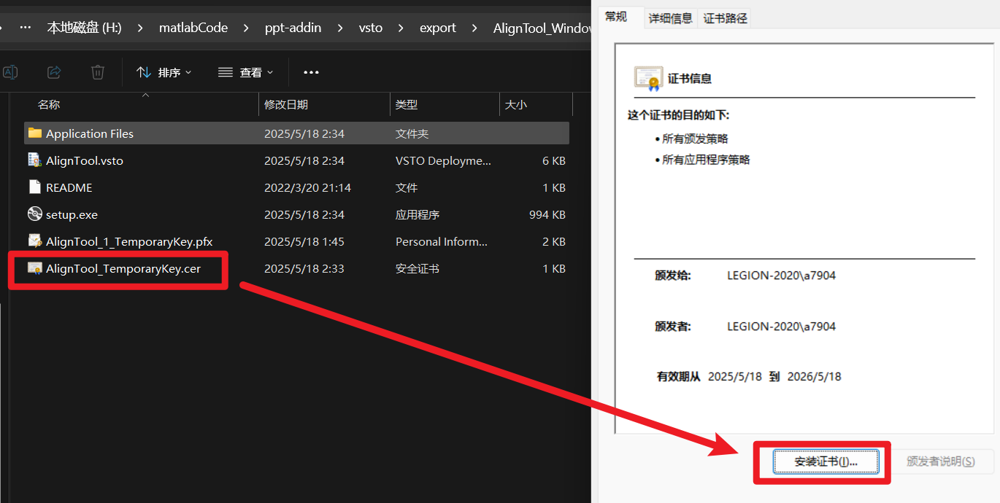
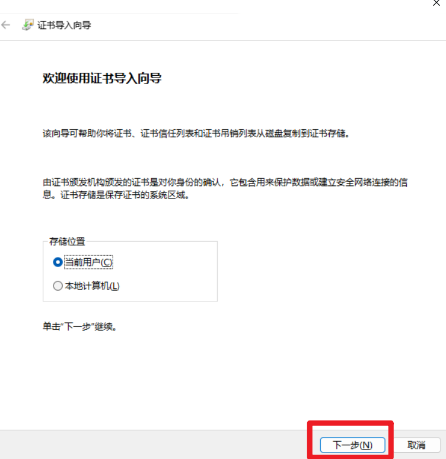
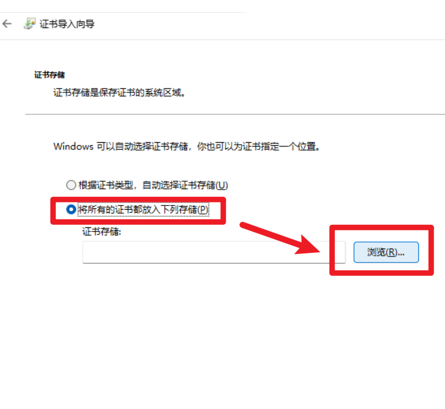
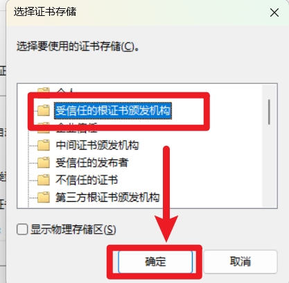
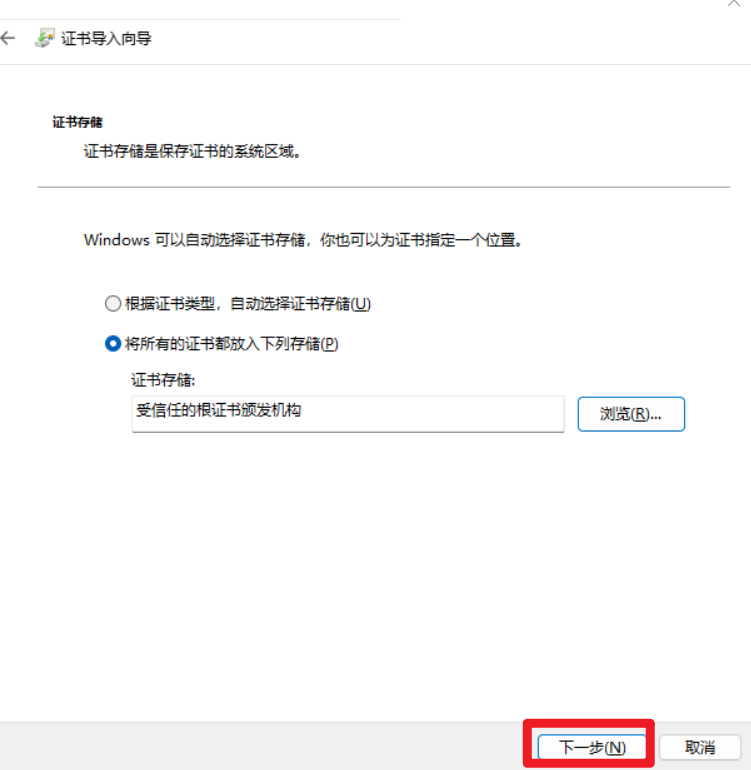

# PowerPoint对齐工具增强版（for Windows）

[插件下载链接](https://github.com/Juzhan/AlignTool/releases/tag/PowerPoint)

## 简介
<!--  -->

由于原版的对齐无法像Ai那样限定对齐对象，所以有了这个小插件。

实现了类似Adobe illusrator的对齐方式，选择多个形状后，它们会以最后被选中的形状作为基准进行对齐。

除此了增强原本对齐方式外，还增加了以将整个集合作为整体与页面对齐的功能，不用将多个形状组合后才能进行对齐。

也实现了一个在原始位置上复制粘贴形状的功能。

## 安装方式

1. 将插件下载解压后，里面有一个setup.exe，如果点击 setup.exe 安装，可能会提示由于不可信任的签名证书而无法安装，因此需要先安装一份签名
2. 这个签名也在压缩后的文件里，双击 `AlignTool_TemporaryKey.cer`，按下面的流程安装证书。

3. 然后点击下一步

4. 然后选择下面的手动设定证书存储

5. 在弹出的窗口中选择“受信任的根证书颁发机构”，然后确定

6. 再点击下一步完成证书签名的安装

7. 前面操作后，再点击 setup.exe 安装插件。安装插件后新的对齐根据会出现在“开始”工具栏的最后，可以右键添加到快速使用栏。

## 卸载方式

1. 打开ppt,进入 文件 > 选项 > 加载项，这里可以看到安装了AlignTool，选中该插件，下方有个“转到”按钮。
2. 然后会跳出 COM 加载项，选择 AlignTool，点击右边的“删除”按钮去除该插件。
3. 进入 控制面板 > 程序 > 程序和功能，找到 AlignTool 软件，点击卸载。
